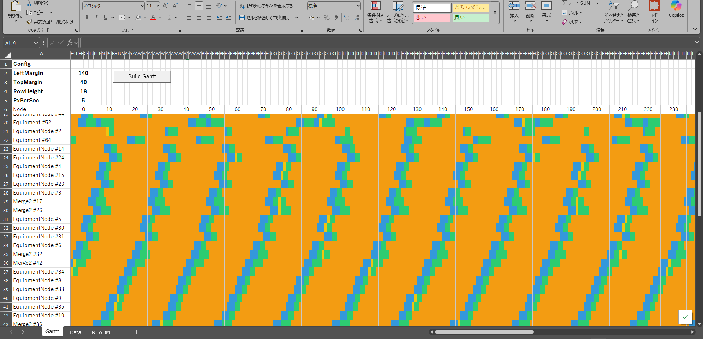

# sim2exl

**概要**
Excel VBAでCSVのタイムチャート履歴を読み込み、ノードごとの状態遷移をタイムチャートとして表示します。1ノード1行、1秒グリッドでセル塗りつぶし表示のためスクロールが軽快です。

**主な機能**
- ノードごとに1行表示（`nodeOrder` で並び順を制御）
- 1秒グリッドで描画、10秒ごとに目盛り線
- セル塗りつぶし表示で軽量動作
- CSVファイル選択ダイアログから履歴ファイルを読み込み
- 状態色分け

**状態の色**
- `process` = 緑
- `wait` = オレンジ
- `down` = 青
- `idle` = 黄色
- その他 = 灰色

**必要環境**
- Microsoft Excel（マクロ有効）
- `timeline.xlsm`

**CSVフォーマット**
以下のヘッダを想定しています。
`node,nodeId,nodeOrder,start,end,duration,state,workId,agvId`

**使い方**
1. `timeline.xlsm` を開きます。
2. `ImportTimelineCsvAndBuild` を実行し、`csv_data` フォルダ内のCSVを選択します。
3. タイムチャートが `Gantt` シートに描画されます。

**マクロ一覧**
- `ImportTimelineCsv` : CSVを `Data` シートに取り込み
- `ImportTimelineCsvAndBuild` : CSVを取り込み、続けてチャートを生成
- `BuildGantt` : `Data` の内容からチャートを生成

**設定値（VBA定数）**
`timeline/timeline.bas` の冒頭で調整できます。
- `GRID_SEC` : グリッド秒数（既定 1）
- `COL_WIDTH` : 1秒あたりの列幅（既定 0.5）
- `LABEL_STEP` : 目盛り間隔（秒）（既定 10）

**シート構成**
- `Data` : CSV取込み先
- `Gantt` : タイムチャート表示

**フォルダ構成**
- `csv_data` : タイムチャートCSVの保存先
- `timeline/timeline.bas` : VBA本体
- `img/スクリーンショット.png` : README表示用スクリーンショット

**補足**
- 目盛りの表示が詰まる場合は `LABEL_STEP` または `COL_WIDTH` を大きくしてください。
- 列幅が狭いほど表示は密になりますが、視認性は下がります。
